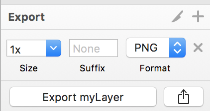
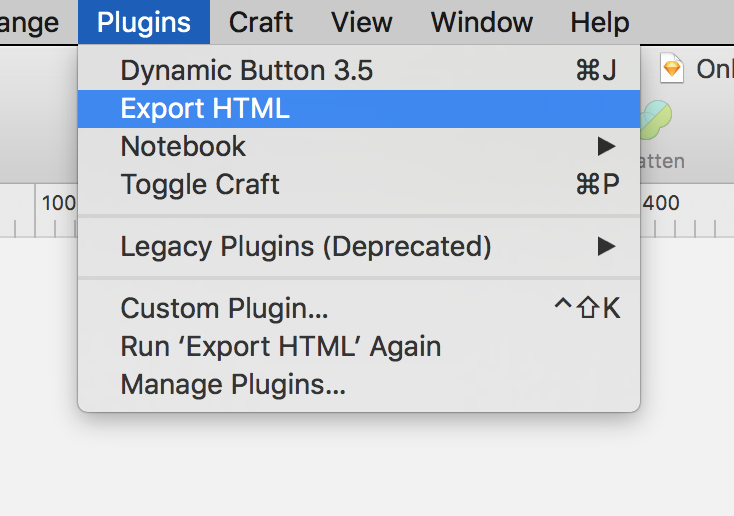
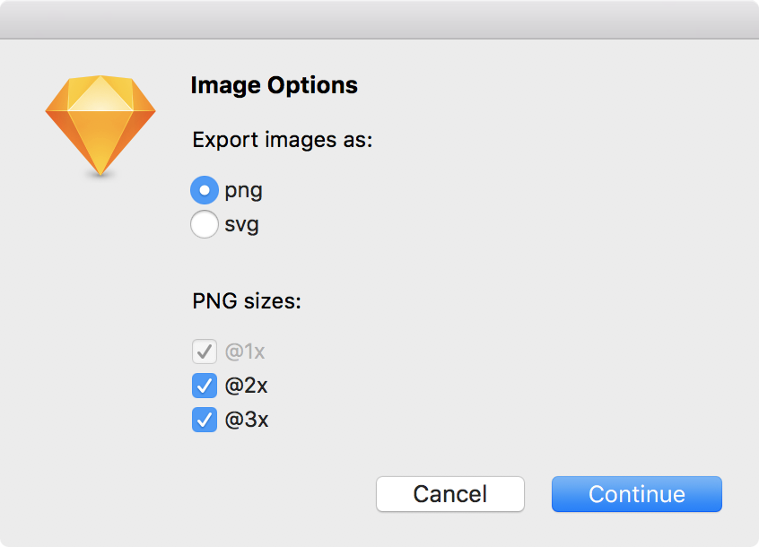
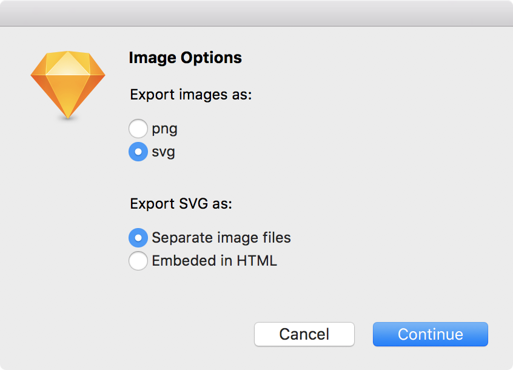

# Sketch-HTML-Export
Sketch plugin to export artboards to HTML &amp; CSS

## Download &amp; Installation
1. [Download](./archive/master.zip) the plugin.
2. Upzip the downloaded file and double-click on "HTML.sketchplugin". It will automatically be installed.

## Using The Plugin
Export the contents of any artboard to an HTML page.

1. Select the layers you wish to include in the export and mark them for export. It doesn't matter what format or scale you select (similarly to [Zeplin](https://zeplin.io).

  

2. Select the artboard or any layer inside the artboard which you wish to export.
3. Select the menu item Plugins > Export HTML

  

4. Select the file format (PNG or SVG) you wish to export the layers and related options.

  

  
  
5. Select a location to save the export.
